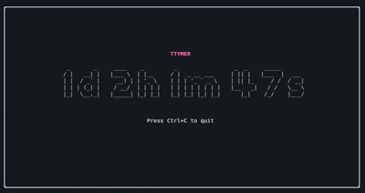

```
 _   _                             
| |_| |_ _   _ _ __ ___   ___ _ __ 
| __| __| | | | '_ ` _ \ / _ \ '__|
| |_| |_| |_| | | | | | |  __/ |   
 \__|\__|\__, |_| |_| |_|\___|_|   
         |___/
```
#

# 
**ttymer** is a simple command-line timer application written in Go that supports both duration-based and time-based countdown functionality.

## Features

- Duration mode: Set timers using days, hours, minutes, and seconds
- Time mode: Set timers to specific clock times (12-hour format)
- Clear countdown display in terminal
- Desktop notification when timer completes

## Installation

```bash
git clone https://github.com/darwincereska/ttymer
cd ttymer
go build
```

## Usage

### Duration Mode
Set a timer for a specific duration using any combination of days, hours, minutes, and seconds:

```bash
./ttymer -d <days> -h <hours> -m <minutes> -s <seconds>
```

Examples:
```bash
# Set a 5-minute timer
./ttymer -m 5

# Set a timer for 1 hour and 30 minutes
./ttymer -h 1 -m 30

# Set a timer for 2 days, 4 hours, 30 minutes, and 15 seconds
./ttymer -d 2 -h 4 -m 30 -s 15
```

### Time Mode
Set a timer that counts down to a specific time:

```bash
./ttymer -t <time> [-p]
```

The `-t` flag accepts time in either 2-digit (1-12) or 4-digit (100-1159) format.
Use the `-p` flag to specify PM times.

Examples:
```bash
# Set timer for 3:00 AM
./ttymer -t 300

# Set timer for 2:30 PM
./ttymer -t 230 -p

# Set timer for 11:45 PM
./ttymer -t 1145 -p
```

## Flags

- `-d`: Days (duration mode)
- `-h`: Hours (duration mode)
- `-m`: Minutes (duration mode)
- `-s`: Seconds (duration mode)
- `-t`: Time (time mode)
- `-p`: PM indicator for time mode
- `-help`: Shows help menu
- `-ui`: enables a tui

## Requirements

- Go 1.x
- Linux/Unix system with `notify-send` for desktop notifications

## Notes

- In duration mode, at least one time unit must be specified
- The timer displays the countdown in real-time in the terminal
- When the timer completes, a desktop notification will be sent
- For time mode, if the specified time has already passed today, the timer will set for the same time tomorrow

## License

[MIT]
